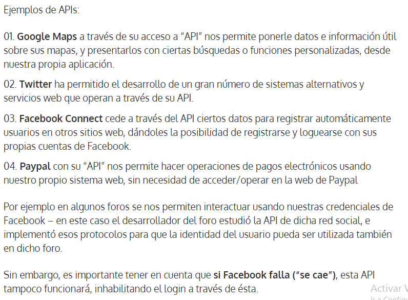

# APIs

- Tipo: `lectura`
- Formato: `self-paced`
- Duración: `30min`

***

## Objetivos de Aprendizaje

- Entender qué es una API enfocado al entorno de AJAX y dónde podemos
  encontrarlas

##  Obtener datos

Hemos analizado los conceptos de Ajax y que es la tecnología que utilizaremos
para agregar datos a nuestro proyecto de forma asíncrona. Pero, ¿De dónde
provienen estos datos? ¿Cómo accedemos a ellos? ¿Cómo sabrá nuestra aplicación
cómo debe recuperar esos datos?

Usaremos una API para interactuar con varias fuentes de datos.

## Qué es una API?

Anteriormente ya habíamos leído que es un **API**
(Application Programming Interface = Interfaz de Programación de Aplicaciones)

Una API es una “llave de acceso” a funciones que podemos utilizar de un
servicio web provisto por un tercero, dentro de nuestra propia aplicación web,
de manerasegura y confiable.

> **Hay datos por ahí que solo esperan ser utilizados.**

<<<<<<< HEAD

=======

>>>>>>> ecbbb00edd44800c7b2f51c15dc469133655c4de

[Google](https://developers.google.com/apis-explorer/#p/) cuenta con una
cantidad enorme de APIs, podemos hacer uso de alguna de ellas o buscar que
otros sitios ofrecen o usan APIs.
