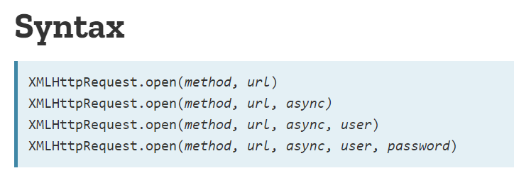

# XHR

- Tipo: `lectura`
- Formato: `self-paced`
- Duración: `90min`

***

## Objetivos de Aprendizaje

- Entender qué es XHR

## Analogía

Una buena manera de entender XHR es usando la siguiente analogía:

> **Preparar un pastel!**
> Para prepararlo necesitamos, harina, huevo, leche, mantequilla y un horno.
> Encendemos el horno. Luego procedemos a mezclar los 4 ingredientes y ya
> lista la mezcla la metemos al horno, aquí va a tardar un poco en lo que se
> hornea pero mientras podemos ir preparando la cubierta del pastel.

Un objeto XHR es proporcionado por el entorno de JavaScript y se utiliza para hacer peticiones AJAX, es muy parecido a la parte de la preparación de la mezcla donde primero debemos "preparar" las configuraciones y luego mandar nuestra petición, pero una vez hecho esto nuestro código puede seguir adelante y hacer otras peticiones o tareas.

> Cuando el horno nos regresa el pastel horneado podemos continuar con
> decorarlo

Una vez que nuestra petición tiene respuesta puede seguir adelante con lo que hayamos dispuesto para esta "tarea".

## XMLHTTPRequest

El entorno de JavaScript nos proporciona una forma de realizar solicitudes
HTTP asíncronas. Esto lo hacemos con un objeto XMLHttpRequest, podemos usar
este objeto con la función de constructor XMLHttpRequest proporcionada.

XMLHttpRequests (comúnmente abreviado como XHR o xhr) se puede utilizar para
solicitar cualquier tipo de archivo (por ejemplo, archivos de texto plano,
HTML, JSON, de imagen, etc.) o datos de una API.

Ahora profundizaremos en el objeto XMLHttpRequest. Veremos cómo crearlo, qué
métodos y propiedades se deben usar y cómo enviar realmente solicitudes
asíncronas.

[XMLHttpRequests](https://www.youtube.com/watch?v=nz9S3uZE_dM)

### El objeto XHR y su método `.open()`

Ya que hemos construido un objeto XHR llamado _asyncRequestObject_.

```javascript
const asyncRequestObject = new XMLHttpRequest ();
```

Podemos acceder a sus métodos, uno de los más importantes es el método `.open()`

asyncRequestObject.open();

`.open()` toma una serie de parámetros, pero los más importantes son sus dos primeros: el método HTTP y la URL para enviar la solicitud.



Si queremos solicitar de manera asíncrona la página de inicio del popular sitio de imágenes de alta resolución, Unsplash, usaremos una solicitud GET y proporcionaremos la URL:

```javascript
asyncRequestObject.open('GET', 'https://unsplash.com');
```

> Los métodos HTTP que por el momento más usaremos son:
> GET - para recuperar datos.
> POST - para enviar datos.

## El objeto XHR y su método `.send()`

Para enviar la solicitud, necesitamos usar el método de envío:

```javascript
asyncRequestObject.send();
```

Ya sabemos que no hay mejor manera de aprender que irlo haciendo, para ver como
funciona, dirígete a [Unsplash](https://unsplash.com), abre tu developer tools
y agrega en consola el objeto y sus métodos open y send.


En el siguiente video podemos ver que es lo pasa, está en inglés pero si vas
haciendo el paso a paso como en el video, seguro que le entiendes.

[](https://youtu.be/m9C0LJoWhOE)

## Manejo de éxitos

Ya que la petición ha sido enviada debemos establecer la propiedad `onload` en
el objeto a una función que manejará la respuesta exitosa de nuestra solicitud
XHR:

```javascript
function handleSuccess () {
    // en la función, `this` es el valor del objeto XHR
    // this.responseText contiene la respuesta del servidor

    console.log( this.responseText ); // el HTML de https://unsplash.com/
}

asyncRequestObject.onload = handleSuccess;
```

Con esto nos damos cuenta que si `onload` no está configurado, la solicitud vuelve pero no ocurre nada con eso.

## Manejo de errores

Ahora veamos que pasa si sucede algo con la solicitud y no se puede cumplir, entonces necesitamos usar la propiedad onerror:

```javascript
function handleError () {
    console.log( 'An error occurred 😞' );
}

asyncRequestObject.onerror = handleError;
```

Al igual que con `onload`, si `onerror` no está configurado y se produce un
error, ese error simplemente fallará en _silencio_ y tu código (¡y tu usuario!)
no sabrá qué es lo que está mal ni cómo recuperarlo.

## Juntando todo

Aquí está el código completo que hemos desarrollado.

Se crea el objeto XHR, se le dice qué información solicitar, configuramos los
manejadores para un éxito o error y luego finalmente se envía la solicitud:

```javascript
function handleSuccess () {
  console.log( this.responseText );

}

function handleError () {
  console.log( 'An error occurred 😞' );
}

const asyncRequestObject = new XMLHttpRequest();
asyncRequestObject.open('GET', 'https://unsplash.com');
asyncRequestObject.onload = handleSuccess;
asyncRequestObject.onerror = handleError;
asyncRequestObject.send();
```

## APIs y JSON

Obtener el HTML de un sitio web está bien, pero probablemente no sea muy útil.
Los datos que devuelve están en un formato que es extremadamente difícil de
analizar y consumir.

Sería mucho más fácil (y útil) si pudiéramos obtener solo los datos que
queremos en una estructura de datos mejor ordenada.

En lugar de solicitar la URL base para Unsplash, creemos una aplicación que
extraiga una imagen de Unsplash's API y artículos relevantes del New York
Times.

Al realizar una solicitud desde una API que devuelve JSON, todo lo que tenemos que hacer es convertir esa respuesta JSON en un objeto JavaScript.
Podemos hacer eso con `JSON.parse();` modifiquemos la función de carga para manejar una respuesta JSON:

```javascript
function handleSuccess () {
  const data = JSON.parse( this.responseText );
  console.log( data );
}

asyncRequestObject.onload = handleSuccess;
```

Para obtener más información sobre el uso del objeto XHR para realizar
solicitudes asíncronas, puedes consultar estos enlaces:

- [MDN's docs](https://developer.mozilla.org/en-US/docs/Web/API/XMLHttpRequest/open)

- [WHATWG Spec](https://xhr.spec.whatwg.org/)

- [W3C Spec](https://www.w3.org/TR/XMLHttpRequest/)
