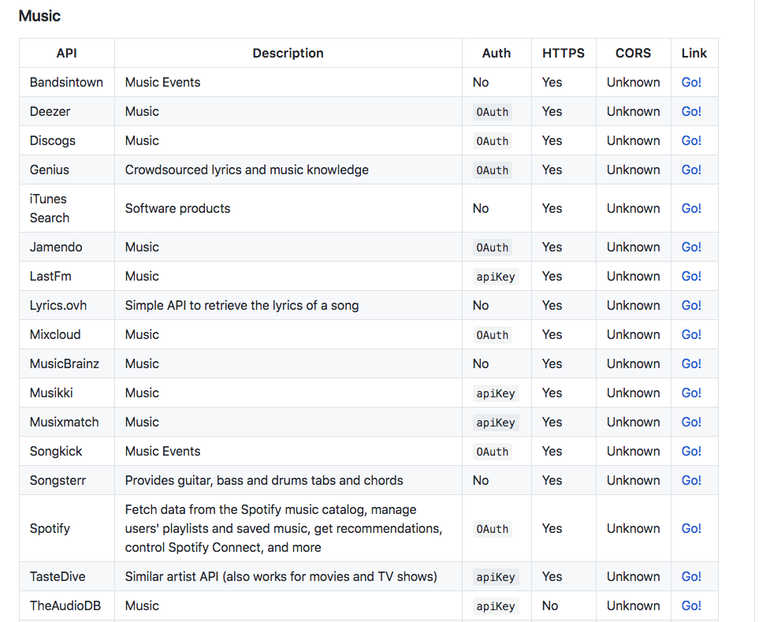

# Web APIs

- Tipo: `lectura`
- Formato: `self-paced`
- Duración: `15min`

***

## Objetivos de Aprendizaje

- Conocer e identificar los distintos tipos de Web APIs con los que podemos
  trabajar

## ¿Dónde puedo saber qué Web APIs públicas hay? 

Ya que en esta unidad vamos a trabajar con Web APIs públicas, debemos de saber 
dónde podemos ver cuáles existen. Para ello, te dejamos los siguientes recursos:

- [Public-APIS](https://github.com/abhishekbanthia/Public-APIs)
- [Any API](https://any-api.com/)
- [Public APIs - Github Repo](https://public.apis.zone/)
- [API Directory](https://www.programmableweb.com/apis/directory)
- [API List](https://apilist.fun/)

> **Nota:** ¿Sabías que todos estos recursos los encontramos googleando 
> `publci APIS`? Así que tu puedes encontrar aun más recursos ;).

Para el objetivo de esta lectura, vamos a enfocarnos en un recurso que no hemos
listado hace un momento: [Public APIs](https://github.com/toddmotto/public-apis).
Este repositorio a diferencia de los demás, tiene una manera sintetizada de 
mostrar la autenticación que requiere un API (los demás recursos también 
muestran este detalle pero no están a primera vista).

En la imagen anterior, podemos visualizar el apartado de las APIs de Música, en
la cual, la columna de `Auth` tiene valores distintos como: `NO`, `apiKey` u 
`OAuth`. Esto nos da un espacio a darles de cierta manera una clasificación a
las Web APIs en base a su medio de autenticación. Así que veamos un poco de qué
trata.
